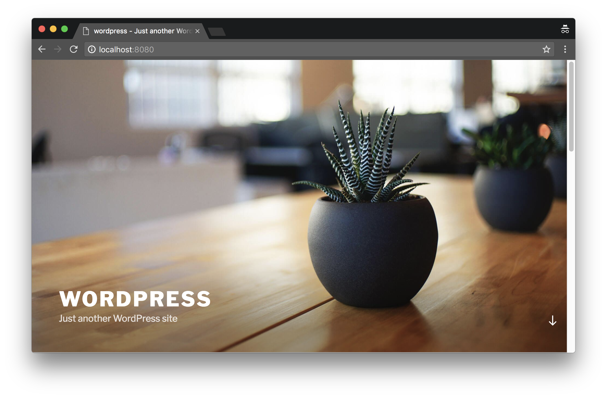
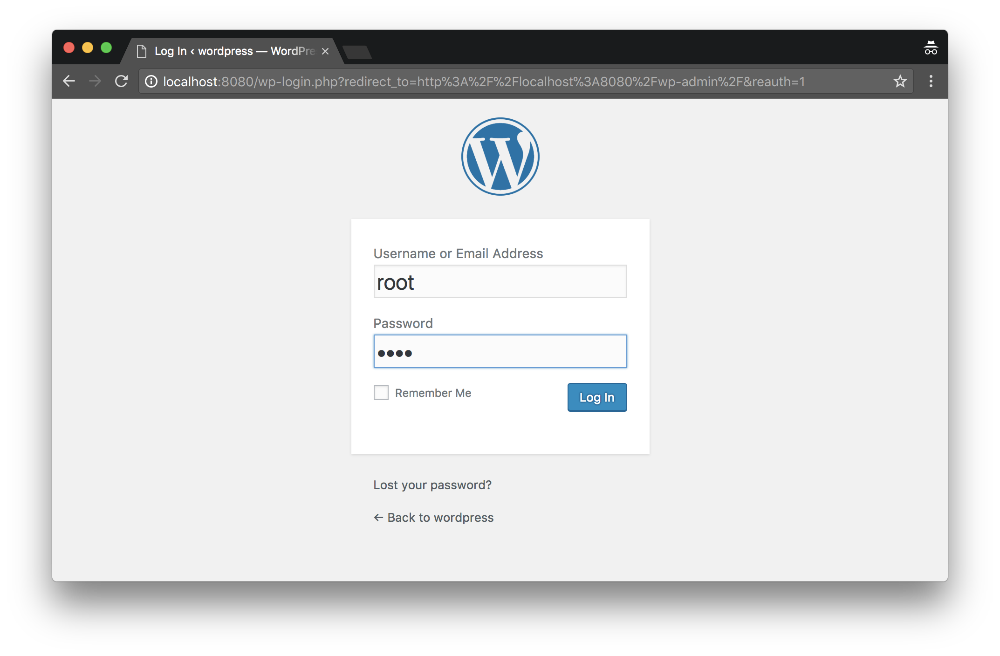
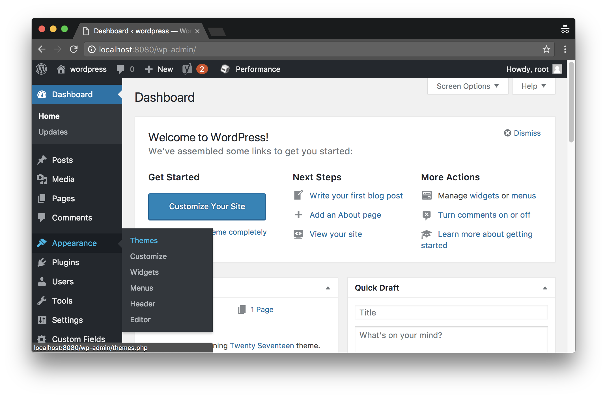
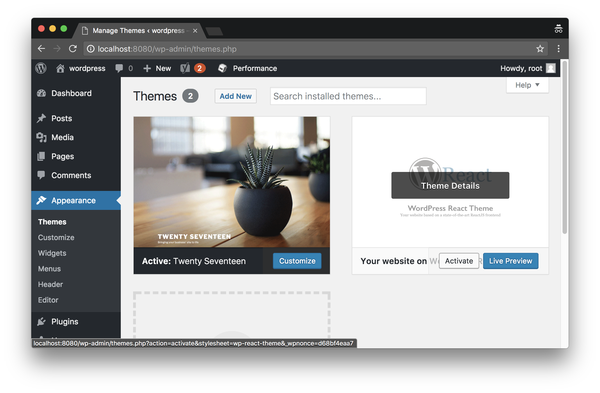

# `wp-react` - More than "just another WordPress site"

WordPress React (or `wp-react`) provides a way to build and host simple and sophisticated websites. It is based on three main parts:

1. WordPress in the backend with a customized REST API
2. React in the frontend; Webpack builds the app into a WordPress theme folder (next to some PHP functions that customize the REST API)
3. Docker composes WordPress and React; basically serves WordPress and mounts the local theme folder

Follow the steps in the [installation guide](#installation) and both Webpack and Docker will have orchestrated `wp-react`.

The source files of the React App can be found in the `/src` folder. `src/sources`, for example, contains 5 connector classes written against the 5 main REST endpoints:
- `pages`
- `posts`
- `headers`
- `footers`
- `sidebars`

The connection to the backend is realized with [wpapi](https://www.npmjs.com/package/wpapi) - a WordPress REST API client.

The basic architecture of the whole React app is based on [Flux](https://facebook.github.io/flux/docs/in-depth-overview.html). The [Alt](http://alt.js.org/) library is currently in use to realize this architecture. That is exactly the reason why there are `src/actions` and `src/stores` folders next to `src/sources` and `src/components` folders. If you are not familiar with Flux or Alt, I recommend to read the [Alt Guide](http://alt.js.org/guide/). It just takes a couple of minutes to read and it is very good.

## Prerequisites

If you are not familiar with WordPress or WordPress development with PHP, then you are in the right place :). `wp-react` is based on WordPress, but it is more in a way of using it as a CMS with a REST API.

It does no harm to be familiar with [docker](https://www.docker.com/), NodeJS/NPM and [ReactJS](https://reactjs.org/) though.

## Installation

First of all, clone the repository and install the NPM dependencies by executing:
```
$ git clone git@github.com:niels-garve/wp-react.git
$ cd wp-react/
$ npm install
```

Start the webpack dev server to serve the React app assets (at `http://localhost:3000`) by running:
```
$ npm run dev
```

Compose the docker container to serve WordPress (at `http://localhost:8080`). Type:
```
$ docker-compose up --file docker-compose.dev.yml
```

Now, open a browser and navigate to `http://localhost:8080`. You will see a WordPress site that still comes dressed in the style of the default theme.


To change this, navigate to `http://localhost:8080/wp-admin` and log in with user `root` and password `root`.


Activate the `wp-react-theme` through the 'Appearance' menu in WordPress.




Having done this, `http://localhost:8080` now shows the (very) basic `wp-react-theme`. Feel free to inspect XHR calls in the inspector of your choice - or the HTML structure.

### DB Handling

Restore the database with /data/database.sql
```
$ docker exec $(docker ps -lq) /bin/bash -c "wp db import /data/database.sql --allow-root"
```

Dump the database to /data/database_bk.sql
```
$ docker exec $(docker ps -lq) /bin/bash -c "wp db export /data/database_bk.sql --allow-root"
```

(see [Setup a local WordPress development environment with Docker](https://visible.vc/engineering/docker-environment-for-wordpress/))

### Shutdown and cleanup

The command
```
$ docker-compose down
```
removes the containers and default network, but preserves your WordPress database.

The command
```
$ docker-compose down --volumes
```
removes the containers, default network, and the WordPress database. (see [docker docs](https://docs.docker.com/compose/wordpress/#shutdown-and-cleanup))

### WordPress CMS

The `wp-react-theme` activates new WordPress menus which allow you to add Headers, Sidebars and Footers. Theses new types - besides the default ones: pages and posts - can now be linked to these: Pages and Posts can have Headers, Sidebars and Footers and this is the core of a very flexible website architecture.

Furthermore, you are free to add new custom fields to Pages, Posts, Headers, Footers and Sidebars, like `date` - or even add completely new custom post types: think of `Addresses`.

## Final words

I'm currently working on further docs and setup improvements. Anyway, I will be glad if you get in touch with me!

Feel free to submit issues if, for example, the installation guide needs improvement; Create pull requests if you have enhanced the core, etc...

I will gladly answer and/or fix issues or collect their ideas in a troubleshooting section.

### License

MIT